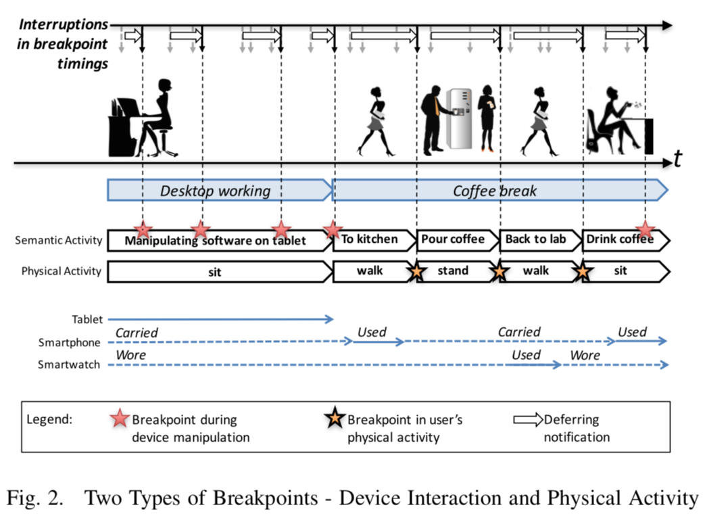
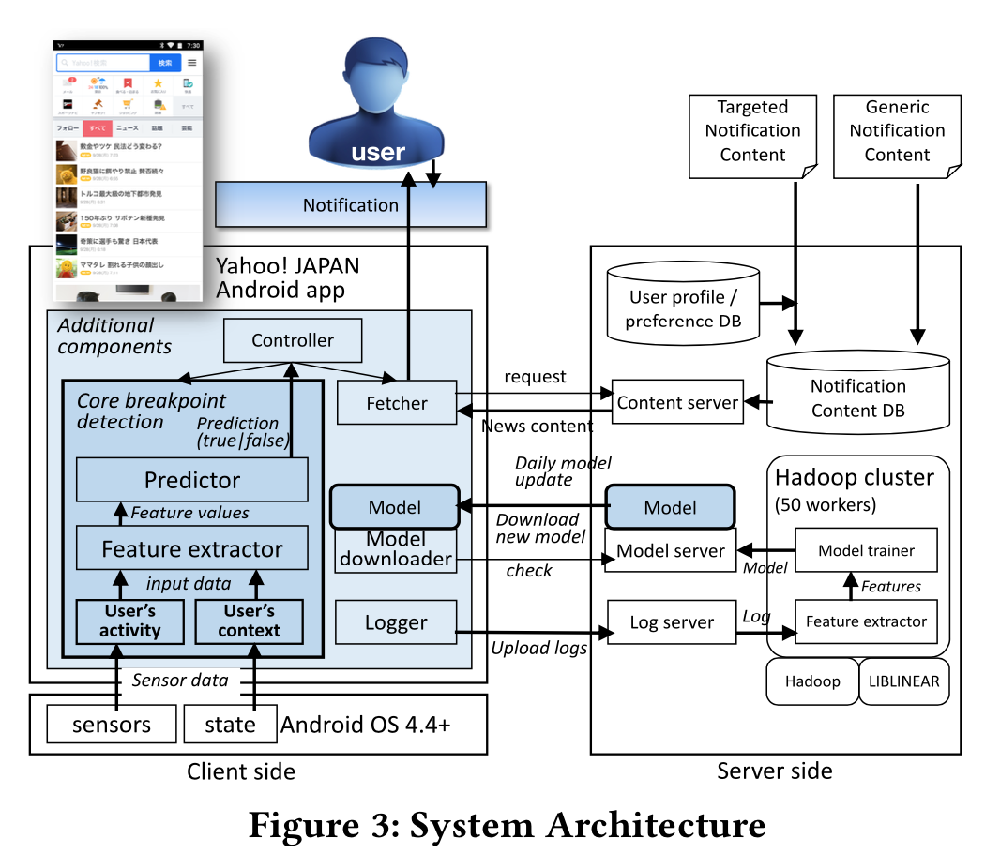
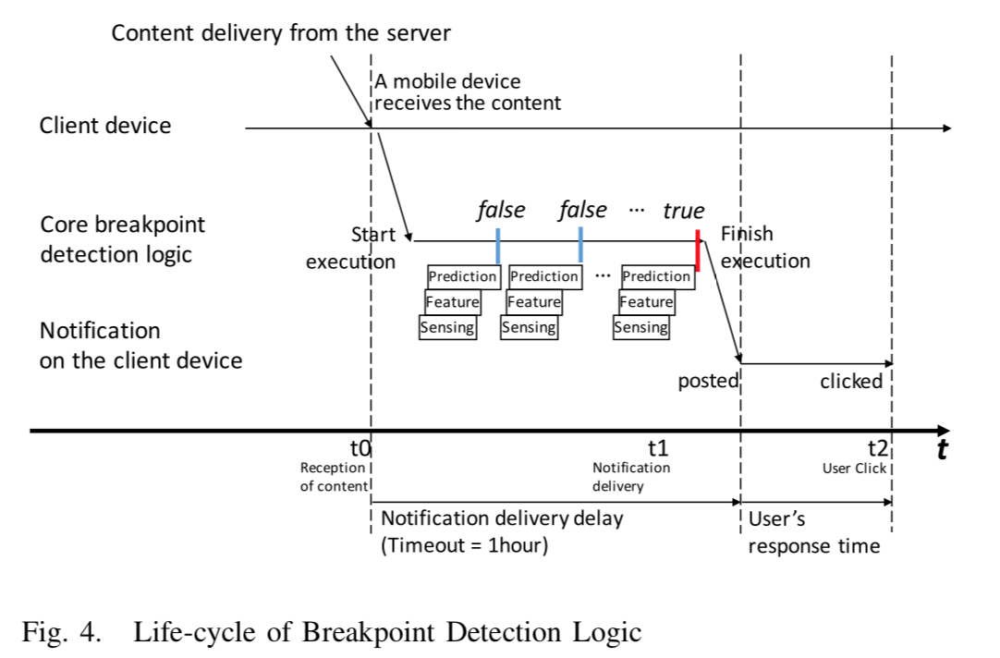
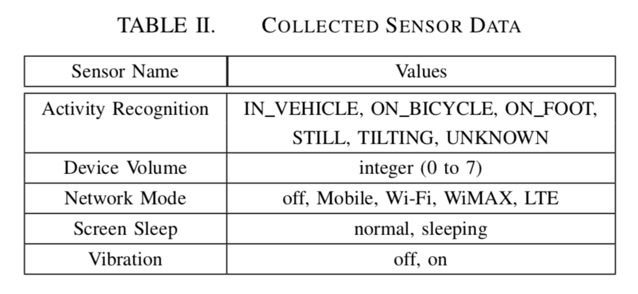
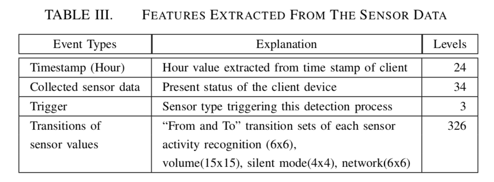

#具有自适应通知的大规模研究
(Yahoo/PerCom'17) Attention and Engagement-Awareness in the Wild: A Large-Scale Study with Adaptive Notifications

###1、intro
（1）使用实际产品应用程序和相关通知对基于断点的自适应通知进行实际评估，主要表明所谓断点的有效性而不是自己捏造的；
（2）此类可中断性估算的软件体系结构设计，以便在客户端和服务器端进行实际部署；
（3）对用户行为的综合评估，不仅包括可中断性，还包括用户对通知内容的进一步参与程度。

###2、些许背景
#####中断过载
现实生活的人们总是被通知消息新闻等无情打扰！当通知被用户感知时，就叫做注意力分散。而这种中断通知会产生生产力、情绪、
社交属性、生理状态的负面影响

#####研究现状
感知人类当前的注意力状态有两个主要目标：用户当前的认知负荷（定义为分配给工作记忆的脑力劳动总量）和可中断性（断点被认为
是中断导致用户减少沮丧感和认知开销的时机——就是相对来说在这个时间点打断是最好的）。三个方面挑战：
* 用户的注意力断点机制没有在真实线上场景来进行评估（以前的文章分析都是画饼？）
* 中断点的检测和自适用通知的系统还需要研究
* 用户对通知内容的进一步参与程度需要评估

###3、研究目标
这项研究旨在调查真实环境中智能手机用户对通知的中断性，并根据系统估计的“最佳时机”进一步与通知的内容进行互动（参与度）。

###4、系统设计
将断点分为两类，物理活动的断点（活动断点主要靠google API），以及设备交互的断点（主要指是否使用设备），如图：

系统结构图如下：

server端push消息到client端，此时触发断点检测，预测模型是放在终端上的（LR）

检测流程图如下：

传感器数据表：

特征抽取：

