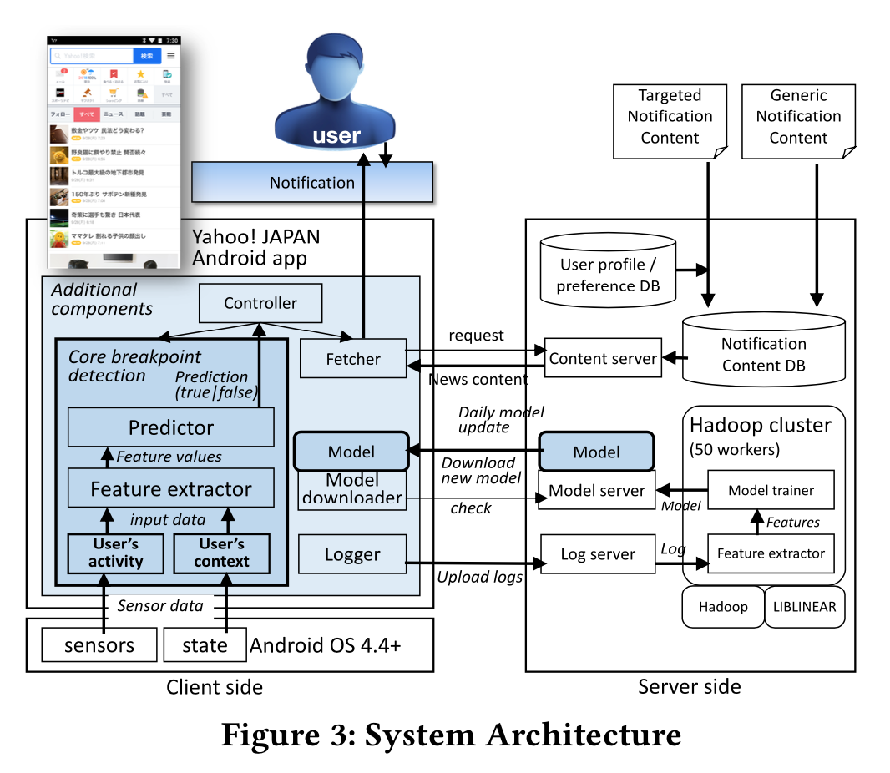

#push自适应系统调度机制
（19th-KDD）Real-World Product Deployment of Adaptive Push Notification Scheduling on Smartphones

###1、intro
push系统的挑战

* 自适应系统是否比常规系统在性能上有所提升
* 专门为每个用户准备的定制通知内容
* 用户通常会遇到的突然的外部因素

自适应系统达到的亮点

* 自适应系统在最终用户的点击率方面获得了10倍以上的收益（平均23.3％，最大41.6％），之前的系统（收益1.9％）
* 个性化内容的通知比通用内容的通知点击率提升了2倍以上
* 当发布大量有关意外突发消息的推送通知（超出系统范围的一天）时，自适应的系统获得了更大的收益

###2、所谓的中断负载
随着越来越多的应用程序和服务在用户当前前台任务的后台运行（本地和远程），并且由于上述原始系统设计意图，
典型的通知系统会立即发送传入的通知，因此用户现在必须面对无论随机操作是什么主要任务，都会在随机的时间发出大量中断通知。而
当用户感知并识别一个通知时，会形成注意力分散。然而用户痛并忍受着。。。（否则关闭通知机制就需要手工轮询）

###3、相关工作

* 基于用户的各种上下文，在某些时间估计可中断性
* 检测断点，断点被认为是中断导致用户减少沮丧感和认知开销的时机——就是相对来说在这个时间点打断是最好的
* 与其他随机时间相比，用户在打电话和发短信后在断点处对通知的响应往往更敏感

###4、挑战和解决方法
####4.1 挑战
在了解自适应通知如何为现实世界中的用户的行为和体验做出贡献方面，仍然有巨大的挑战。目的是将该技术永久部署到我们的产品基础结构中。

* 挑战1————用户经常变化的活动导致性能提升不足————之前的系统只提升了1.9%的点击量。并且对于工作日和休息日在断点检测模型中，最大的贡献特征
明显不同，这似乎是导致可中断性评估的ML分类性能下降和不稳定的原因。
* 挑战2————系统在处理个性化通知方面的性能挑战————个性化适应性通知服务性能要求高，尤其是用户量较大的情况下，参见push平台
* 挑战3————不定期的通知高峰期间系统的有效性问题————流量峰值的影响
####4.2 方法
* 在系统层（第5节）上构建了新的可中断性估计机制以及相应的自适应通知调度，并使用了各种新技术组件，例如新功能和可中断性估计分类器。
* 我们将系统部署为处理两种不同类型的通知类，以查看在个性化通知的情况下我们的机制运行情况如何（性能）（第6节）
* 评估结果————大规模研究报告了分别对C1（第7节），C2（第8节）和C3（第9节）的评估结果

###5、系统
####5.1 系统结构
我们的可中断性估算方法是检测每个用户的断点（两个相邻活动的边界），这被认为是用户接收信息的适当时机，因为它们处于较低的认知负荷和精神努力阶段(心理学？玄学？)

图3所示的系统通过使用终端传感器（能识别用户当前活动的Google活动识别————超纲了！）和机器学习技术，实时检测用户在智能手机上进行活动时的时机。

* 使用活动标签流以及设备上的其他传感器读数，计算特征，并使用经过训练的线性回归模型识别当前时刻是否为断点。应用的时候一旦收到push通知，相应的自适应通知
组件就会等到检测出的下一个断点才显示（设置超时时间T——1小时，没有断点就舍弃，该时间设置由后续实验数据支撑，2.4%的超时率）。
* 构建样本时正样本选择为断点发送通知之后10秒内点击就算成功检测出断点
* 没有针对用户进行个性化断点检测，一视同仁

####5.2 处理用户跨天级别的上下文的变化
针对挑战1，文章在上述baseline系统结构的基础上部署ML组件

* 加用户活动相关特征（通过终端传感器、google活动识别？），如时间、设备状态、触发检测的传感器类型、传感器值的变化
* 引入上下文（时间、设备相关），将周末和工作日模型融合为一个天级模型，引入的方式不是加特征的方式，是cross特征的方式：

$y= \sum _{i}\omega _{t,i}\cdot x_{t,i} + \sum _{i}\omega _{d,i}\cdot x_{d,i} + \sum _{i}\omega _{e,i}\cdot x_{e,i} + \omega _{0}$

###6 系统部署研究
平衡个性化和通知类型（全用户统一）的push，个性化是按照用户喜好分群，并非真正的个性化

