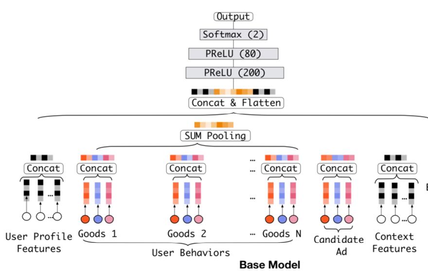
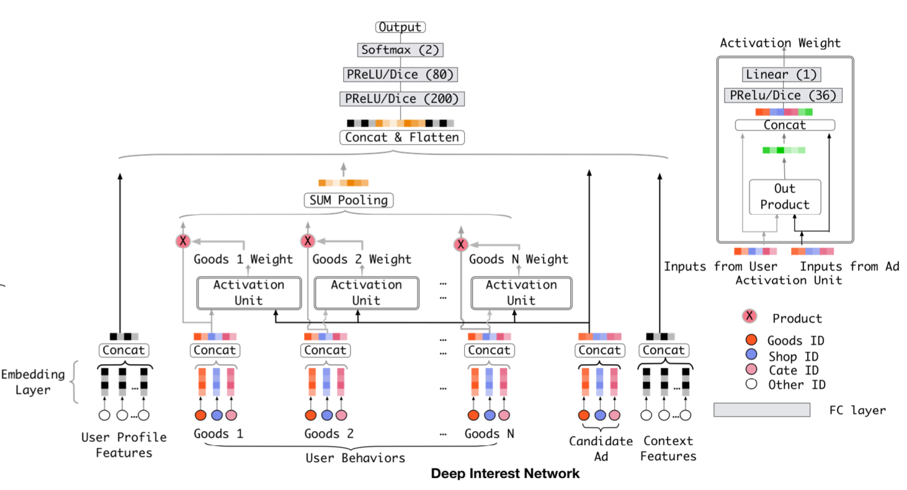

# DIN
[原文链接](https://arxiv.org/pdf/1706.06978.pdf)

##Abs
Embedding&MLP——大规模的稀疏输入特征被映射成为低维embedding向量，然后用分组的方式转换成固定长度的向量，最后将它们串联在一起，馈入多层感知器（MLP），以了解特征之间的非线性关系。这样，无论候选广告是什么，用户特征都被压缩为固定长度的表示向量。固定长度向量的使用将成为瓶颈，这将使Embedding＆MLP方法难以从丰富的历史行为中有效捕获用户的各种兴趣。在本文中，我们提出了一个新颖的模型：深度兴趣网络（DIN），它可以通过设计一个本地激活单元来适应性地学习用户兴趣的表示，从历史行为到某个广告，来解决这一挑战。同时开发了mini-batch aware regularization and data adaptive activation function来解决数据训练问题
* 使用用户兴趣分布来表示用户多种多样的兴趣爱好
* 使用Attention机制来实现Local Activation
* 针对模型训练，提出了Dice激活函数，自适应正则，显著提升了模型性能与收敛速度

## Intro
* Diversity——用户在访问电商网站时会对多种商品都感兴趣。也就是用户的兴趣非常的广泛。
* Local Activation——用户是否会点击推荐给他的商品，仅仅取决于历史行为数据中的一小部分，而不是全部。

DIN同时对Diversity和Local Activation进行建模。
* 针对Diversity：
针对用户广泛的兴趣，DIN用an interest distribution去表示。

* 针对Local Activation：
DIN借鉴机器翻译中的Attention机制，设计了一种attention-like network structure， 针对当前候选Ad，去局部的激活(Local Activate)相关的历史兴趣信息。和当前候选Ad相关性越高的历史行为，会获得更高的attention score，从而会主导这一次预测。

当DNN深度比较深(参数非常多)，输入又非常稀疏的时候，很容易过拟合。DIN提出**Adaptive regularizaion**来防止过拟合，效果显著。

##BackGround
阿里推荐系统工作流程为：
1.检查用户历史行为数据
2.使用matching module产生候选ads
3.通过ranking module得到候选ads的点击概率，并根据概率排序得到推荐列表
4.记录下用户在当前展示广告下的反应(点击与否)
5.这是一个闭环的系统，对于用户行为数据(User Behavior Data)，系统自己生产并消费。

##主要内容
###特征表达
论文中作者把特征分为四大类——用户特征、用户行为特征、广告特征、上下文特征，**并没有进行特征组合/交叉特征**。而是通过DNN去学习特征间的交互信息。其中只有**用户行为特征**中会出现`multi-hot`
>Embedding -> Pooling + Attention

###评价标准
AUC表示正样本得分比负样本得分高的概率。在CTR实际应用场景中，CTR预测常被用于对每个用户候选广告的排序。但是不同用户之间存在差异：有些用户天生就是点击率高。以往的评价指标对样本不区分用户地进行AUC的计算。论文采用的GAUC（阿里自己提的）实现了用户级别的AUC计算，在单个用户AUC的基础上，按照点击次数或展示次数进行加权平均，消除了用户偏差对模型的影响

###Base Model(Embedding&MLP)
#### Embedding Layer
对于第i个特征，对应所谓的embedding字典
* 对于one-hot vector，则对应一个单一的embedding向量
* 对于multi-hot， 则对应一组embedding向量

####Pooling layer and Concat layer

####MLP & loss
MLPlayer负责预测，Loss function是Log Loss。整个Model的结构如图所示。

###DIN结构
池化层虽然能达到目的，但却会损失很大一部分信息。DIN的关键就是利用attention机制学习locally activated information，从而尽可能减少信息损失。DIN引入了一个激活结构，并使用了如下系统结构：

可以看到，最关键的区别就在激活结构上。DIN借鉴了机器翻译领域中常用的attention机制，但和原始的attention结构并不相同。这个attention结构会导致原本的sum pooling变成一个weighted sum pooling，从而学习到locally activated information。简单地说，通过把ad的embedding和behavior的embedding相乘并输入一个**FNN网络**，我们得到了一个 activation weight，利用这个weight，我们将behaviour的embedding结合起来。

##训练技巧
###Mini-batch Aware Regularization
我们使用正则化方法来防止过拟合。但是L2正则化意味着在每一个mini-batch的训练中，都需要计算全部参数的更新，这会导致沉重的计算负担，在大规模数据集中尤其不可接受。所以文章提出了Mini-batch Aware Regularization方法，这个方法能利用数据集的稀疏性减少计算量。具体细节可以去看原文。

###Data Adaptive Activation Function
PReLu是一种常用的激活函数，它固定在x = 0时出现转折，但当每一层的输入数据的分布不同时，并不是很合适。阿里提出了一种新的激活函数Dice，是PReLu的一种扩展。具体细节可以去看原文。
